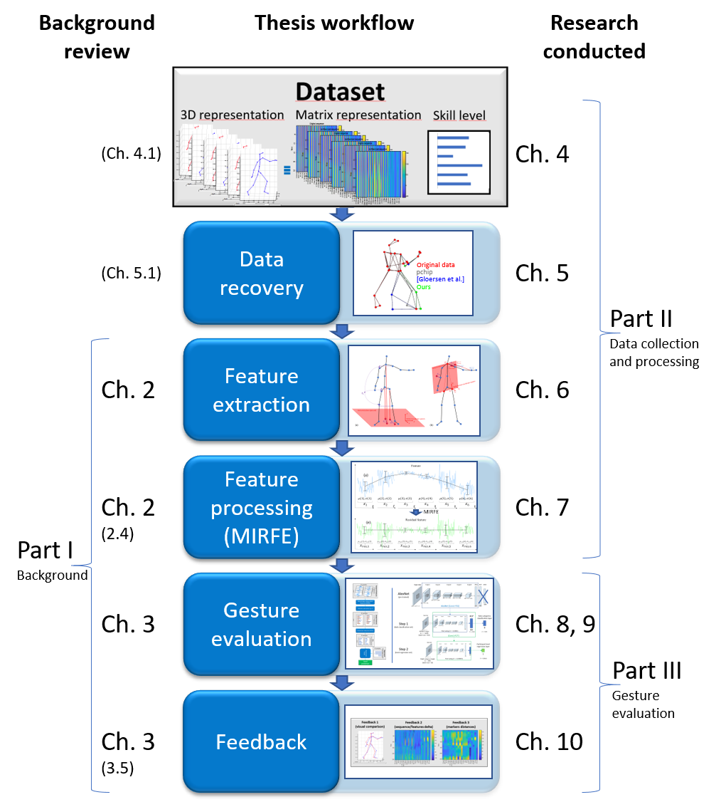

# About

Dr Mickaël Tits is senior research engineer at <a href="https://www.cetic.be">CETIC</a> since 2018.
He completed a Master’s degree in Civil Engineering specialized in Telecommunications and Multimedia at the University of Mons (UMONS 2014), and completed his graduation work at McGill University in Montreal. He then pursued a doctoral thesis at the University of Mons within the <a href="https://numediart.org">Numediart</a> institute, on the automatic evaluation of gesture expertise by motion capture and machine learning (UMONS 2018). He also participated in the development of the <a href="https://github.com/numediart/ofxMotionMachine">MotionMachine</a> framework, allowing the manipulation, interactive visualization and data analysis of Motion Capture.
He then joined CETIC in October 2018 to strengthen the data analysis team. His interests are in artificial intelligence, and its application in many areas such as health and industry.

<!--
<a href="https://github.com/titsitits" class="btn btn-info" role="button">My github</a>
<a href="https://scholar.google.be/citations?user=FUFY6bYAAAAJ&hl=fr" class="btn btn-info" role="button">Google Scholar</a>
<a href="https://be.linkedin.com/in/micka%C3%ABl-tits-28144269" class="btn btn-info" role="button">Linkedin</a>
<a href="https://www.researchgate.net/profile/Mickael_Tits" class="btn btn-info" role="button">ResearchGate</a>
-->

Contact: mickaeltits AT gmail.com

# CV

<embed src="../assets/files/CV-Mickael-Tits-En-2019.pdf" style="width:100%;" height="600" type="application/pdf">
<!--a href="../assets/files/CV-Mickael-Tits-En-2019.pdf" class="btn btn-info" role="button">Download CV</a-->

# Recent projects

## [Technological Innovation Partnership "Big Data Platform"](https://www.cetic.be/Big-Data-Platform)

This Technological Innovation Partnership aims at building the first version of the Big Data service catalog (infrastructure and software) which will be made available through the Platform of Innovation (PFI).

## [DigiMIR](https://www.cetic.be/DigiMIR-2790)

Development of a research project in the field of cultural and creative industries and the automatic recognition of multimedia flows, with the aim of bridging these technologies with issues related to the Internet of the future.

In this context, an open-source framework for image restoration is currently in active development, and available at: [github.com/titsitits/open-image-restoration](https://github.com/titsitits/open-image-restoration)

## [Wal-e-Cities/LIV](https://www.cetic.be/WAL-E-CITIES-LIV-3294)

The "Wal-e-Cities" project portfolio aims to meet the challenges of Walloon cities, in a "Smart Region" philosophy. The main purpose of this portfolio is to develop devices and software that will deliver services and meet needs in four areas: mobility; energy and environment; transparent data exchange market; living environment and well-being of the citizen. Non-technological components will be integrated in order to use the technology wisely and compare the results to the concrete needs of users (citizens, municipal authorities, local businesses, etc.).

## [University of Namur - Data Analytics course](https://directory.unamur.be/staff/titsm/courses)

Designed a course for preparing bachelor students in Business Engineering to the brand new [Master in Data Science at University of Namur](https://www.unamur.be/etudes/master/catalogue/data-science).
The course is fully in French, and open-source, available at: [www.mickaeltits.be/Python_Data_Science](http://www.mickaeltits.be/Python_Data_Science)

# Thesis

<h3 id="no_toc">Expert Gesture Analysis through Motion Capture using Statistical Modeling and Machine Learning</h3>
<a href="../assets/files/ThesisMickaelTits.pdf" class="btn btn-info" role="button">Download Thesis</a>

## Abstract
The present thesis is a contribution to the field of human motion analysis. It studies the possibilities for a computer to interpret human gestures, and more specifically to evaluate the quality of expert gestures. These gestures are generally learned through an empirical process, limited to the subjectivity and own perception of the teacher. In order to objectify the evaluation of the quality of these gestures, researchers have proposed various measurable criteria. However, these measurements are still generally based on human observation. 

Enabled by significant steps in the development of Motion Capture (MoCap) and artificial intelligence technologies, research on automatic gesture evaluation has sparked a new interest, due to its applications in education, health and entertainment. This research field is, however, recent and sparsely explored. The few studies on the subject generally focus on a small dataset, limited to a specific type of gestures, and a data representation specific to the studied discipline, hereby limiting the validity of their results. Moreover, the few proposed methods are rarely compared, due to the lack of available benchmark datasets and of reproducibility on other types of data. 

The aim of this thesis is therefore to develop a generic framework for the development of an evaluation model for the expertise of a gesture. The methods proposed in this framework are designed to be reusable on various types of data and in various contexts. The framework consists of six sequential steps, for each of which an original contribution is proposed in the present thesis: 

Firstly, a benchmark dataset is proposed to promote further research in the domain and allow method comparison. The dataset consists of repetitions of 13 Taijiquan techniques by 12 participants of various levels from novice to expert, resulting in a total of 2200 gestures. 

Secondly, the MoCap data must be processed, in order to ensure the use of high-quality data for the design of an evaluation model. To that end, an original method is proposed for automatic and robust recovery of optical MoCap data, based on a probabilistic averaging of different individual recovery models, and the application of automatic skeleton constraints. In an experiment where missing data were simulated into a MoCap dataset, the proposed method outperforms various methods of the literature, independently of gap length, sequence duration and the number of simultaneous gaps. 

Thirdly, various motion features are proposed for the representation of various aspects of motion, potentially correlated with different components of expertise. Additionally, a new set of features is proposed, inspired by Taijiquan ergonomic principles. In this respect, 36 new motion features, representing aspects of stability, joint alignments, joint optimal angles and fluidity are presented. 

Fourthly, the features must be processed to provide a more relevant representation of expertise. In the present work, the morphology influence on motion is addressed. Morphology is an individual factor that has a great influence on motion, but is not related to expertise. A novel method is therefore proposed for the extraction of motion features independent of the morphology. From the linear modeling of the relation of each feature with a morphological factor, residues are extracted, providing a morphology-independent version of the motion features. As a consequence, the resulting features are (i) less correlated between each other, and (ii) enable a more relevant comparison between the gestures of various individuals, hereby allowing a more relevant modeling of expertise. Results show that the method, termed as Morphology-Independent Residual Feature Extraction (MIRFE) outperforms a baseline method (skeleton scaling) in (i) reducing the correlation with the morphological factor, and in (ii) improving the correlation with skill, for various gestures of the Taijiquan MoCap dataset, and for a large set of motion features. 

Fifthly, an evaluation model must be developed from these features, allowing the prediction of the expertise level on a new gesture performed by a new user. A model based on feature statistics, dimension reduction and regression is proposed. The model is designed to be used with any motion feature, in order to be generic and relevant in different contexts, including various users and various types of gestural disciplines. Trained on the Taijiquan MoCap dataset, the model outperforms two methods of the literature for the evaluation of gestures of a new user, with a mean relative prediction error of 10% ( R=0.909 ). 

Additionally, a first exploration of the use of deep learning for gesture evaluation is proposed. To that end, MoCap sequences are represented as abstract RGB images, and used for transfer learning on a pre-trained image classification convolutional neural network. Despite a lower performance ( R=0.518 ), an analysis of the results suggests that the model could achieve better performance given a larger dataset, including a larger number of novices and experts. 

Sixthly, and finally, to allow a practical use of the evaluation model, a feedback system must provide an intuitive interpretation of the predicted level, allowing an effective understanding and assimilation by the user of the system. In the present work, an original and generic feedback system is proposed, based on the synthesis of an improved gesture, and its comparison to the user's original gesture. Both intuitive and precise feedback are proposed, based on (i) synchronized visualization of both gestures, and (ii) striped images highlighting the motion features that need improvement. As a validation of the proposed method, examples of feedback are proposed for various sequences of the Taijiquan MoCap dataset, showing its practical interest for objective and automated supervision.

## Overview

## Content

<embed src="../assets/files/ThesisMickaelTits.pdf" style="width:100%;" height="700" type="application/pdf">

