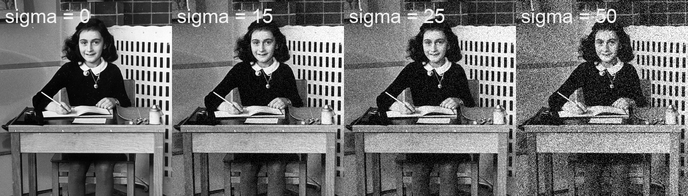
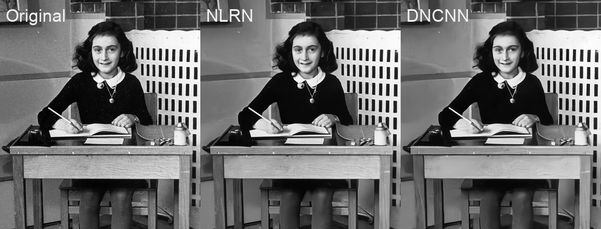
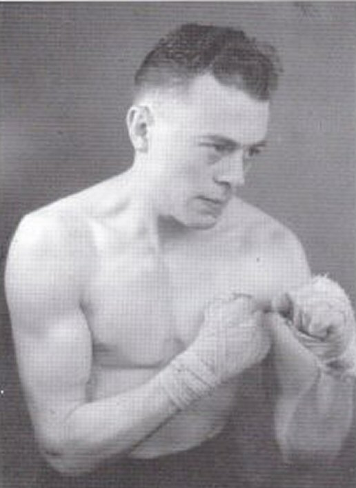

# Restauration d'image par réseaux de neurones profonds

##### Cas d'application : un ouvrage en hommage aux sportifs belges, nivellois

Mickaël Tits - CETIC - 05/11/2019

(ON-GOING WORK!)

## Introduction

contexte: Projet de recherche DigiMIR (multimedia information retrieval, avec numediart), intérêt marqué par l'organisation le Rif Tout Dju (club de photographie de Nivelles), et le journaliste/auteur Jean Vandendries.

applications:  images historiques, caméras surveillance, récup images numérisées, images compressées sur le web, capteurs low-cost/smartphones, images médicales

use case testé: Ouvrage de Jean Vandendries (en cours d'édition)

## Un pipeline de techniques de restauration d'image

### Des techniques diverses et variées

L'état de l'art de la restauration d'image se divise actuellement en différentes techniques distinctes, permettant chacune de corriger un type particulier d'artéfacts indésirables présents dans une image, ou d'inférer artificiellement de l'information supplémentaire à l'image (telle que des couleurs, ou des détails). Dans le cadre du présent projet de recherche, nous nous sommes intéressés, jusqu'à présent, à quatre techniques en particulier:

1. La suppression de bruit gaussien
2. La suppression de rayures (bruit de bande - stripe noise)
3. La colorisation
4. La super-résolution

En pratique, une image de faible qualité présente souvent différents types de défauts, et à des degrés divers. Une image historique sera souvent limitée à une échelle de gris, une faible résolution, des artéfacts dus à la détérioration d'un support physique (tel que du papier jauni et écaillé par le temps), et à la numérisation de celui-ci. L'application individuelle des techniques susmentionnées n'aura alors qu'une portée limitée sur les possibilités de restauration de cette image. Afin de restaurer efficacement une image, il est donc nécessaire d'appliquer un ensemble de ces techniques.

### Une mise en série compliquée

Dans ce projet, nous avons étudié la mise en série de ces différentes techniques, de manière à obtenir une restauration holistique d'une image. Cette mise en série n'est en réalité pas un problème trivial, car l'application d'une technique peut fortement impacter le résultat de la technique subséquente. Dans certains cas, elle peut améliorer le résultat: l'application de la super-résolution sur une image bruitée risque parfois d'augmenter les détails d'un artéfact indésirable, telle qu'une rayure, de la neige ou tout autre type de bruit. Si tel est le cas, l'application préalable d'une technique de réduction du bruit rendra plus efficace la super-résolution. 

L'impact des techniques précédant la colorisation d'une image est particulièrement important également : la colorisation par réseaux de neurones profonds se base en grande partie sur l'analyse sémantique du contenu d'une image. L'algorithme apprend dans une certaine mesure à reconnaître un objet, grâce à sa forme et sa texture, lui permettant ensuite de déterminer quelle est sa couleur la plus probable. Le bruit d'une image peut rendre difficile l'analyse sémantique, et en particulier l'analyse des textures des objets. L'application d'une technique de réduction de bruit, ou d'augmentation des détails (super-résolution), peut alors faciliter la reconnaissance d'une texture.

A l'inverse, l'état de l'art de ces techniques est encore limité et imparfait, et l'application de certaines techniques peut parfois engendrer une perte significative d'information, ou la création de nouveaux artéfacts indésirables. C'est notamment le cas de la réduction de bruit gaussien, qui a souvent tendance à trop "lisser" les images, c'est-à-dire à éliminer une partie de leur texture. Ainsi par exemple, la texture poreuse d'une surface de béton, poussiéreuse d'une terre battue, ou herbeuse d'un gazon peuvent devenir identiquement lisses après application imparfaite de cette technique. Dans ce cas, la colorisation d'un jardin ou d'un mur de briques peuvent résulter en une surface grisâtre sans texture claire. A l'inverse, la super-résolution peut parfois "inventer" des détails peu réalistes, rendant la texture tout aussi ininterprétable. Dès lors, l'ajustement minutieux de la séquence et des paramètres d'un pipeline de techniques de restauration d'image devient important. Malheureusement, il est difficile, voire impossible, d'identifier un pipeline d'opérations idéal, car les résultats peuvent varier selon les caractéristiques et les défauts d'une image.

### Des outils hétérogènes et incompatibles

La littérature informatique se distingue souvent par sa vaste hétérogénéité. En effet, il possible d'implémenter un même algorithme avec de nombreux outils différents, souvent incompatibles entre eux. Différents langages de programmation, différents frameworks ou librairies, ou encore différentes versions d'une librairies peuvent être utilisés, rendant difficile l'intégration dans un même programme de techniques dont les implémentations sont incompatibles entre elles. 

Dans le présent contexte, les algorithmes de Deep Learning sont le plus souvent implémentés en Python. Les librairies de Deep Learning les plus connues sont en effet Tensorflow, Keras et Pytorch, toutes trois développées ou principalement utilisées en Python. Néanmoins, d'autres langages, tel que Matlab, sont aussi fréquemment utilisés. Son utilisation, bien que sans doute due partiellement à des raisons historiques, est également due à la nature du traitement d'image nécessitant de nombreux processus d'algèbre matricielle, calculs particulièrement bien supportés par Matlab. C'est notamment le cas d'un algorithme actuellement premier dans plusieurs classements de référence concernant la réduction de bruit : [ Multi-level Wavelet-CNN for Image Restoration - MWCNN (CVPR, 2018)](https://paperswithcode.com/paper/multi-level-wavelet-cnn-for-image-restoration#code)

Etant donné le côté fermé d'un langage comme Matlab (programme payant, closed-source), certains de ces algorithmes sont réécrits en Python. C'est notamment le cas d'un des premiers algorithmes de réduction de bruit utilisant les réseaux de neurones profonds : [ Beyond a Gaussian Denoiser: Residual Learning of Deep CNN for Image Denoising - DnCNN (TIP, 2017)](https://github.com/cszn/DnCNN). On trouve pour celui-ci, des ré-implémentations en PyTorch et Keras.

D'autres outils sont parfois utilisés pour optimiser les performances computationnelles, permettant ainsi un traitement plus rapide des images. C'est notamment le cas des frameworks [Caffe](http://caffe.berkeleyvision.org/) et [Torch](http://torch.ch/), utilisés par exemples dans les travaux suivants: [ Image Super-Resolution for Anime-Style Art](https://github.com/nagadomi/waifu2x), [ Residual Dense Network for Image Super-Resolution  (CVPR 2018)](https://github.com/yulunzhang/RDN).

### Des performances hétérogènes et peu réalistes

Chaque implémentation d'une technique est testée et validée différemment par son développeur. En général, les images ayant obtenus les meilleurs résultats sont utilisées pour présenter le travail. Afin de rendre plus objective la comparaison des performances des algorithmes, divers classements, basés sur des mesures standards et sur des jeux de données standards sont utilisés. Cependant, ceux-ci se limitent également à un ensemble restreint d'images d'un type particulier. On retrouve par exemple des classements sur les jeux de données [URBAN100](https://paperswithcode.com/sota/image-super-resolution-on-urban100-4x) (100 images de paysages urbains), et [Manga109](https://paperswithcode.com/sota/image-super-resolution-on-manga109-4x) (109 images d'animation). Les jeux d'images de test habituels peuvent être visualisés [ici](http://vllab.ucmerced.edu/wlai24/LapSRN/).

Le site paperswithcode.com référence de nombreux classements pour chacune des techniques évoquées plus haut. Pour la super-résolution par exemple, [six classements](https://paperswithcode.com/task/image-super-resolution) sont actuellement référencés:

 

Classements en super-résolution d'image - <a href="https://paperswithcode.com/task/image-super-resolution">paperwithcode.com</a> (05/11/2019)

Le classement comparant le plus grand nombre d'algorithmes est actuellement le "Set5 - 4x upscaling", comparant les résultats sur seulement cinq images spécifiques (voir figure suivante). Cependant, les performances sur un ensemble de cinq images ne garantissent absolument pas l'efficacité sur d'autres images aux caractéristiques potentiellement très différentes. De plus, des contextes d'application typiques nécessitant de la restauration d'image (tel que des images prises par des capteurs low-cost, par des smartphones, de images nocturnes de vidéosurveillance, ou encore images historiques) ne sont pris en compte dans aucun de ces classements.

Jeu de données de test Set5. (source: <a href="http://vllab.ucmerced.edu/wlai24/LapSRN/">http://vllab.ucmerced.edu/wlai24/LapSRN/</a> )

Classement "Set5 - 4x upscaling" - <a href="https://paperswithcode.com/sota/image-super-resolution-on-set5-4x-upscaling">paperwithcode.com</a> (05/11/2019)

Pour terminer, bien que la qualité d'une image est un critère subjectif, des mesures objectives doivent être utilisées non-seulement pour entraîner les algorithmes (par apprentissage profond), mais également pour les comparer de manière objective. Néanmoins, ces mesures ne reflètent pas la réalité, car elles sont généralement basées sur une comparaison d'une image de bonne qualité à une image de qualité artificiellement réduite. Plus de détails sur l'entraînement des algorithmes par apprentissage profond, et des mesures de qualité de reconstruction peuvent se trouver [ici](https://titsitits.github.io/super_resolution/).

### Des licences hétérogènes et parfois contraignantes

Outre les contraintes dus aux outils et à la variabilité des performances, la réutilisation de travaux de l'état de l'art peut être soumise à des contraintes légales, régulés par des termes de licence, définissant les droits de réutilisation et de modification d'un projet. Certaines licences rendent des projets "libres de droits", ce qui signifie que n'importe qui peut les réutiliser, les modifier, peu importe le contexte. Les licences libres de droits les plus couramment utilisées pour des programmes informatiques sont [MIT](https://en.wikipedia.org/wiki/MIT_License), [Apache](https://en.wikipedia.org/wiki/Apache_License) et [GPL](https://en.wikipedia.org/wiki/GNU_General_Public_License). D'autres licences permettent la réutilisation en ajoutant certaines contraintes, comme une utilisation non-commerciale (e.g.: [CC-BY-NC](https://creativecommons.org/licenses/by-nc/2.0/)). Certains projets ont aussi une licence ad-hoc (personnalisée), comme par exemple [Neural Nearest Neighbors Networks (NeurIPS, 2018)](https://github.com/visinf/n3net/blob/master/LICENSE.md), qui interdit également une utilisation commerciale de leur code. Enfin, d'autre projets n'incluent simplement pas de licence, les rendant ainsi simplement visible publiquement, mais concrètement inutilisables dans le développement d'un nouveau projet sous licence.

### Un domaine en pleine expansion

L'utilisation des réseaux de neurones profonds dans la recherche, et en particulier dans le traitement d'images est actuellement un champ de recherche particulièrement en mouvement. L'état de l'art évolue rapidement. A titre d'exemple, lors de la phase de ce projet portant sur la comparaison d'algorithmes de super-résolution (voir [ici](https://titsitits.github.io/super_resolution/)), l'algorithme [ESRGAN: Enhanced Super-Resolution Generative Adversarial Networks (ECCV, 2018)](https://paperswithcode.com/paper/esrgan-enhanced-super-resolution-generative) était premier dans la plupart des classements. Ses performances semblent néanmoins avoir été surpassées depuis, par une autre algorithme: [Second-Order Attention Network for Single Image Super-Resolution (CVPR 2019)](https://paperswithcode.com/paper/second-order-attention-network-for-single). Cependant, ce dernier n'a a l'heure actuelle aucune licence spécifiée (son utilisation n'est donc par officiellement libre de droit).

## Une sélection d'algorithmes libres de droits, utilisables, et compatibles

Dans ce projet, nous avons tenté d'obtenir un compromis entre un pipeline de restauration d'images à la fois générique et efficace. Un ensemble d'algorithmes implémentant différentes techniques de restauration d'image ont été sélectionnés de manière à fonctionner ensemble dans un même programme, à donner un résultat le plus robuste et générique possible, et réutilisable en pratique (i.e. libre de droits, et facile à mettre en œuvre).

Ainsi, pour chacune des quatre techniques évoquées plus haut, une analyse comparative de différents algorithmes a été réalisée.

La plupart des algorithmes ont été identifiés par une recherche systématique sur le site [paperswithcode.com](https://www.paperswithcode.com) dans les catégories respectives, ou directement sur le site [github.com](https://www.github.com), le site d'hébergement de référence de codes publics.

### Réduction de bruit gaussien

De nombreux classements concernant la réduction de bruit sont accessibles sur: [https://paperswithcode.com/task/image-denoising](https://paperswithcode.com/task/image-denoising)

Ces classements se distinguent par les jeux d'images de test utilisés ( BSD ou Urban100), et par l'amplitude du bruit gaussien (représenté par sont écart-type *sigma*) simulé dans ces images, et réduit ensuite par les algorithmes. Le jeu d'images BSD contient des images de scènes naturelles assez variées [[1][1]], et semble plus générique que le Urban100, qui se limite à des paysages urbains, principalement des images d'immeubles aux profils très réguliers.

Parmi les classements basés sur BSD, les classements [BSD68 sigma50](https://paperswithcode.com/sota/image-denoising-on-bsd68-sigma50), [BSD68 sigma25](https://paperswithcode.com/sota/image-denoising-on-bsd68-sigma25) et [BSD68 sigma15](https://paperswithcode.com/sota/image-denoising-on-bsd68-sigma15) ont été retenus, car ils contiennent un plus large nombre d'algorithmes testés. Les deux derniers ont été testé sur des images avec une simulation de bruit plus "réaliste" (*sigma = 25* et *sigma = 15* respectivement), comme le montrent les exemples ci-dessous.

Différents bruit gaussiens simulés dans une image (source de l'image <a href="https://upload.wikimedia.org/wikipedia/commons/thumb/a/a4/AnneFrank1940_crop.jpg/524px-AnneFrank1940_crop.jpg">ici</a> ).

Sur ces deux derniers classements, les seuls travaux proposant une licence libre de droits sont :

1. [ NLRN - Non-Local Recurrent Network for Image Restoration (NeurIPS, 2018)](https://github.com/Ding-Liu/NLRN) - MIT
<!-- 2. [N3Net - Neural Nearest Neighbors Networks (NeurIPS, 2018)](https://github.com/visinf/n3net) - licence ad-hoc, utilisation non-commerciale -->
3. [DnCNN - Beyond a Gaussian Denoiser: Residual Learning of Deep CNN for Image Denoising (TIP, 2017)](https://github.com/husqin/DnCNN-keras) - MIT (implémentation Keras uniquement)

D'après les places occupées par ces deux méthodes dans le classement, NLRN devrait donner les meilleurs résultats. Bien que la comparaison visuelle soit tout à fait subjective, NLRN semble effectivement donner de meilleurs résultats pour l'image de test. DNCNN semble lisser l'image et enlever une partie de sa texture. Cela se remarque particulièrement sur le bureau en bois présent dans l'image, ainsi que sur les cheveux devenus flous.

Comparaison de méthodes de réduction de bruit (NLRN vs DNCNN)

Si seul le critère de qualité du résultat est pris en compte, NLRN semble donc plus efficace. Malheureusement, d'un point de vue rapidité de calcul, le traitement a mis environ 4 secondes pour DNCNN, et 380 pour NLRN, pour une image d'une taille de petite taille (349x400 pixels). Bien sûr, l'algorithme peut être paramétré de manière à diminuer ce temps de traitement, au détriment de la qualité du résultat.

### Réduction des rayures (stripe noise)

La réduction des rayures dans une image est une technique de restauration d'image plus rarement abordée dans la littérature. Selon le contexte, c'est pourtant une technique qui peut parfois être particulièrement efficace. Ce fut notamment le cas dans le contexte de restauration d'images historiques fournies par un collaborateur du projet, le journaliste et auteur Jean Vandendries. Dans le cadre de l'édition d'un ouvrage sur les sportifs nivellois, un ensemble d'images ont été restaurées avec des réseaux neuronaux. Voici par exemple une photo d'un champion de boxe Belge, Pol Goffaux:

Pol goffaux (crédits: Jean Vandendries)

Voici un exemple peut-être encore plus parlant:

Jules Robaeys (crédits: Jean Vandendries)

Voici quelques implémentations de techniques de réductions de rayures trouvées dans la littérature:

1. [SNRCNN -  Single infrared image stripe noise removal using deep convolutional networks (IEEE Photonics Journal 2017)](https://github.com/Kuangxd/SNRCNN_Matlab)

2. [DLSNUC -  Single-image-based nonuniformity correction of uncooled long-wave  infrared detectors: a deep-learning approach," Appl. Opt. 57, D155-D164  (2018) ](https://github.com/hezw2016/DLS-NUC)

3. [ICSRN - Removing stripe noise from infrared cloud images via deep convolutional networks. (IEEE Photonics Journal 2018)](https://github.com/NUIST-xiaopengfei/ICSRN)

4. [WDNN - Wavelet Deep Neural Network for Stripe Noise Removal (IEEE Access, 7, 2019)](https://github.com/jtguan/Wavelet-Deep-Neural-Network-for-Stripe-Noise-Removal)

Parmi ces quatre algorithmes, seule la dernière est implémentée en Python, et libre de droit (licence Apache 2.0.

# Références

[1]:  Berkeley Segmentation Dataset :  Martin, D., Fowlkes, C., Tal, D., & Malik, J. (2001, July). A  database of human segmented natural images and its application to  evaluating segmentation algorithms and measuring ecological statistics.  Vancouver: Iccv. 